# Lab 3 – The Command Line: Shell, Pipes and Text Filters

Course: Operating Systems, FCIM / FAF, UTM, 2026-2027. Track A: the real OS, from the outside (Linux).

This page explains everything that was done in the lab, step by step: every command, what it printed, and why. The figure numbers are the same as in the Word report, so the two can be read side by side.

## What is in this folder

| File | What it is |
|---|---|
| `Lab3_EftodeAndrei_FAF-242.docx` | The report: title page, 39 screenshots, the answers to every Observe box and to Q1-Q8 |
| `oneliners.sh` | The eight questions of Part 4 (and the bonus), each answered with one command line |
| `report.sh` | The script of Part 5, with the TODO loop written |
| `screenshots/` | The terminal screenshots shown on this page (`fig-1-1.png` is Figure 1.1, and so on) |

## How to run it

Everything runs inside the folder `~/os-lab3` on a Linux machine.

```bash
mkdir -p ~/os-lab3 && cd ~/os-lab3

# 1. generate the data set (the same for everyone)
for i in $(seq 1 500); do
  echo "2026-10-05 10:$(printf %02d $((i % 60))) user$((i % 7)) $([ $((i % 5)) -eq 0 ] && echo FAIL || echo OK) /page$((i % 4))"
done > access.log

# 2. copy oneliners.sh and report.sh here, then:
bash oneliners.sh
chmod +x report.sh
./report.sh access.log
```

## The environment

- A Windows 11 laptop with a Linux virtual machine: Ubuntu 26.04.1 LTS in VirtualBox, user `vboxuser`, computer name `os`.
- The shell is `bash`. A shell is the program that reads the line you type and runs it.
- The prompt looks like `vboxuser@os:~/os-lab3$`: user, computer, the current folder, and `$` for a normal user. `~` means the home folder, `/home/vboxuser`.

## Before the lab

### Preparing the laptop

The course gives one script, `os2026-setup.sh`, that prepares a Linux machine for all the labs. It was saved in `~/Downloads` and run once:

```bash
cd ~/Downloads
bash os2026-setup.sh
```

It does four things, and prints `[ OK ]` after each:

1. Installs the packages with `apt`: `git`, `make`, `gcc`, the RISC-V compiler, QEMU, `man-db`, `cron`, `python3`, `bc`.
2. Checks that the tools exist: `git`, `make`, `gcc`, `bash`, `grep`, `sed`, `awk`, the RISC-V compiler and QEMU 7.2 or newer.
3. Looks for xv6 in `~/xv6-riscv`. Mine was already there from Lab 2, so the script left it as it was.
4. Builds xv6 and boots it once, typing `ls` inside it to prove that it answers.

One thing had to be fixed first. This virtual machine still had its installation CD listed as a place to download packages from (`/etc/apt/sources.list.d/cdrom.sources`). The CD is not there any more, so `apt-get update` failed, and the script stops when that step fails. I switched that one source off by adding the line `Enabled: no` at the top of the file. After that the script ran to the end.

The last line must be green, **All set.**, and it was:

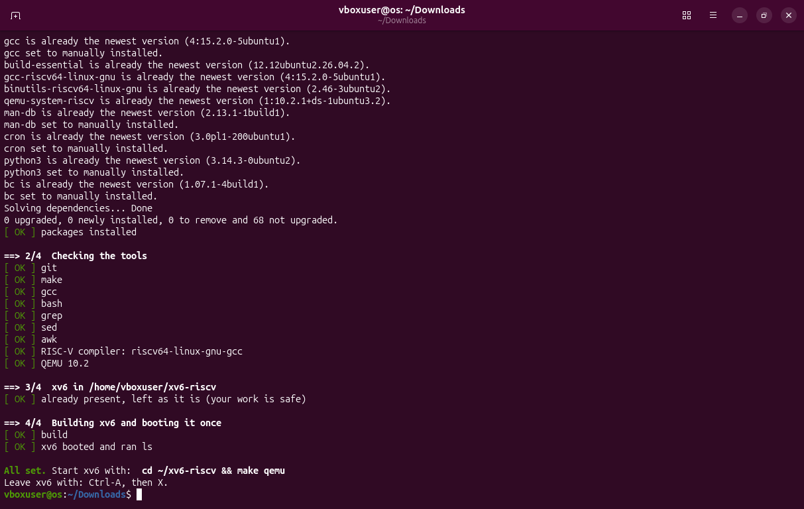

### The data set

Part 4 needs a file to ask questions about. The lab sheet gives a loop that writes an artificial web log of 500 lines:

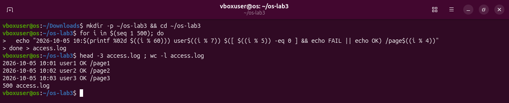

How that loop works:

- `for i in $(seq 1 500); do ... done` repeats the middle line with `i` = 1, 2, ... 500. `seq 1 500` prints those numbers.
- `$(( ... ))` is arithmetic. `%` is the remainder of a division, so `i % 7` is always between 0 and 6.
- `printf %02d` prints a number with two digits (`7` becomes `07`).
- `[ $((i % 5)) -eq 0 ] && echo FAIL || echo OK` prints `FAIL` when `i` divides by 5, and `OK` otherwise.
- `> access.log` after `done` sends everything the loop prints into the file.

So each line has five fields separated by one space: date, time, user, result, page.

```
2026-10-05 10:01 user1 OK /page1
```

Because the loop is plain arithmetic, the answers can be predicted: one line in five fails (100 of 500), there are seven users (`user0` to `user6`) and four pages (`/page0` to `/page3`). `wc -l access.log` printed `500 access.log`, as the sheet demands.

## Part 1 – Move fast, find help

### Tab completion

The Tab key asks bash to finish the word you are typing.

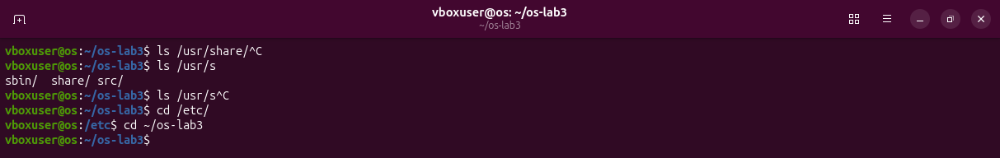

- I typed `ls /usr/sh` and pressed Tab. Only one name in `/usr` starts with `sh`, so bash completed it to `ls /usr/share/`. The second Tab did nothing, because there was nothing left to complete. (`^C` in the picture is Ctrl+C: I cancelled the line instead of running it.)
- I typed `ls /usr/s` and pressed Tab twice. Now three names match, so bash cannot choose. The second Tab lists the candidates: `sbin/ share/ src/`.
- I typed `cd /et` and pressed Tab once. It became `cd /etc/`.

The rule: one match is completed at once; with several matches, a second Tab shows them.

### History search with Ctrl+R

I ran three commands (`date`, `whoami`, `uname -r`), then pressed Ctrl+R and typed `da`.

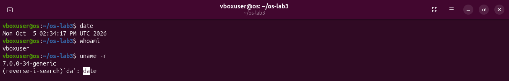

Bash searched backwards through the commands I had typed and showed the last one that contains `da`: `date`. Enter runs it again. This is faster than pressing the up arrow many times.

### Built-in or external? Where does the shell look?

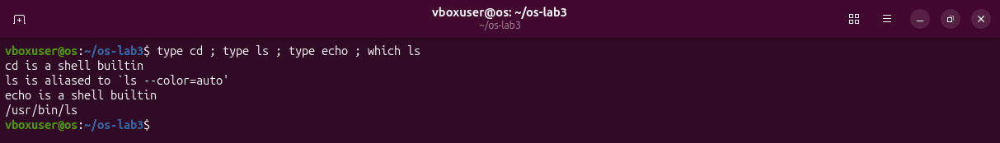

- `type name` tells what the shell will do with a name.
  - `cd is a shell builtin`: `cd` is part of bash itself. There is no file called `cd`.
  - `ls is aliased to 'ls --color=auto'`: Ubuntu defines a shortcut so that `ls` always shows colours. Behind it is a real program.
  - `echo is a shell builtin`.
- `which ls` prints the file that would run: `/usr/bin/ls`. So `ls` is an external program.
- `;` only separates commands on one line. They run one after the other.

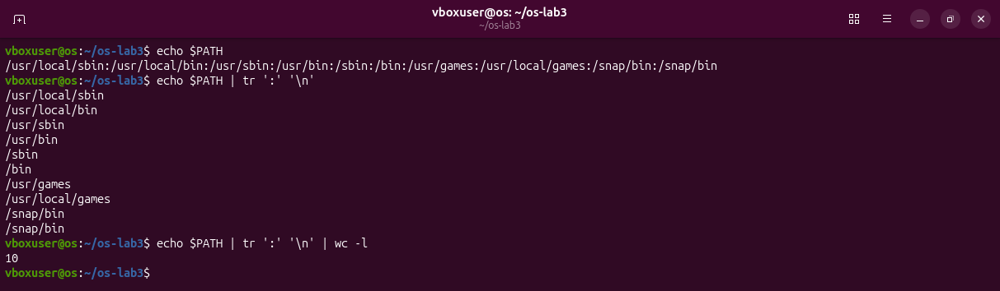

- `PATH` is a variable that holds a list of folders separated by `:`. When I type a command that is not a built-in, bash looks for a file with that name in these folders, in order, and runs the first one it finds.
- `echo $PATH | tr ':' '\n'` makes the list readable. `|` (a pipe) sends the output of `echo` into `tr`, and `tr ':' '\n'` replaces every `:` with a new line.
- Adding `| wc -l` counts the lines: **10 directories**. (`/snap/bin` is there twice.)

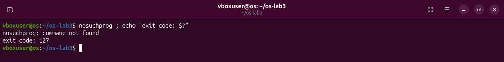

- Every command ends with a number, its exit code. `0` means success; anything else means some kind of failure.
- `$?` holds the exit code of the last command.
- `nosuchprog` does not exist in any `PATH` folder, so bash prints `command not found` and the exit code is **127**.

### Finding help without a browser

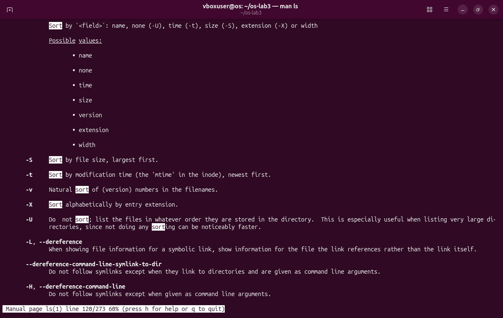

- `man ls` opens the manual page of `ls`. Inside it, `/sort` searches for the word "sort", `n` jumps to the next match, and `q` quits.
- A few presses of `n` reach the line `-t  Sort by modification time (the 'mtime' in the inode), newest first.` That is the answer to question 4.

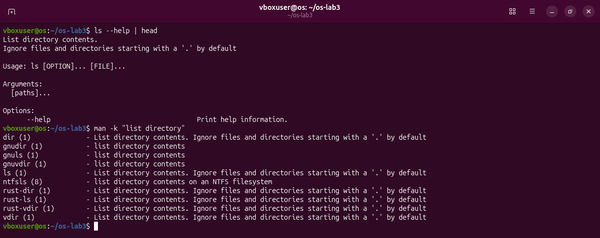

- `ls --help | head` prints the short help of the program; `head` keeps only the first 10 lines.
- `man -k "list directory"` searches the one-line descriptions of all manual pages. It is how you find a command when you do not know its name.

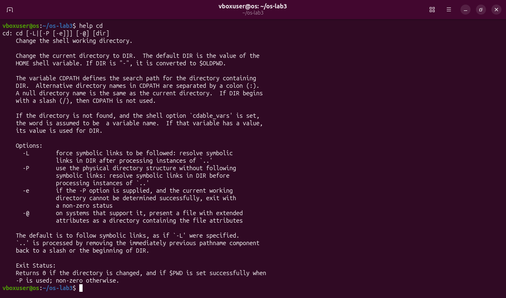

- `help cd` is the help for built-ins. `cd` has no manual page of its own, because it is not a program.

### Answers

1. **Which are built-ins, and why must `cd` be one?** `cd` and `echo` are built-ins; `ls` is an external program (`/usr/bin/ls`). The current folder belongs to each process separately. An external `cd` would be a new process: it would change its own folder, exit, and the shell would still be where it was. Only the shell can change the shell's folder.
2. **How many directories are in PATH, and where is `ls`?** 10, and `ls` is in `/usr/bin`.
3. **Exit code of a command that is not found?** 127.
4. **Which option of `ls` sorts by modification time?** `-t`.

## Part 2 – What the shell does to your line

The main idea of the whole lab: **the shell rewrites the line before it starts any program.** The program never sees what I typed. It sees what is left after the shell has replaced patterns, variables and quotes.

A test folder with six files, one of them with a space in its name:

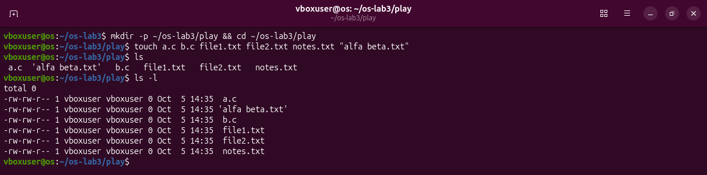

`touch` creates empty files. The name with a space had to be written in quotes, `"alfa beta.txt"`, otherwise `touch` would create two files.

### Patterns (globbing)

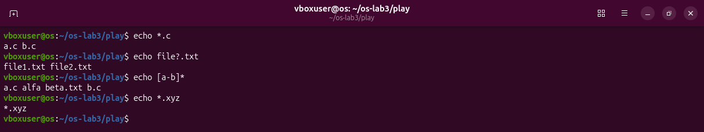

| Pattern | Means | Result |
|---|---|---|
| `*.c` | any name that ends in `.c` | `a.c b.c` |
| `file?.txt` | `?` is exactly one character | `file1.txt file2.txt` |
| `[a-b]*` | first character is `a` or `b`, then anything | `a.c alfa beta.txt b.c` |
| `*.xyz` | any name that ends in `.xyz` | nothing matches, so the pattern stays: `*.xyz` |

`echo` only prints its arguments. It never looks at the disk. The file names came from bash, which replaced each pattern with the list of matching names and only then started `echo`.

### A name with a space

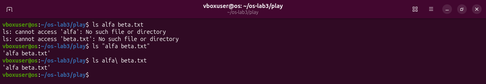

- `ls alfa beta.txt` fails with two errors. Bash cuts the line into words at the spaces, so `ls` receives two names, `alfa` and `beta.txt`, and neither exists.
- Fix 1: quotes, `ls "alfa beta.txt"`. Everything between the quotes is one word.
- Fix 2: a backslash, `ls alfa\ beta.txt`. The backslash removes the special meaning of the next character, here the space.

### Quotes

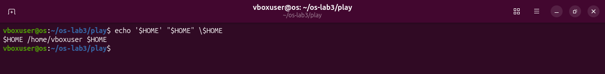

`echo '$HOME' "$HOME" \$HOME` printed `$HOME /home/vboxuser $HOME`.

- Single quotes: nothing inside is touched. `$HOME` stays as text.
- Double quotes: `$HOME` is replaced with its value, but spaces and `*` lose their special meaning.
- Backslash: protects just the next character, so `\$` is a plain dollar sign.

### Other expansions

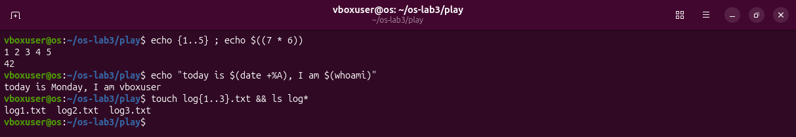

- `{1..5}` is brace expansion: bash writes out `1 2 3 4 5`.
- `$((7 * 6))` is arithmetic: `42`.
- `$(command)` is command substitution: bash runs the command and puts its output in that place. `$(date +%A)` became `Monday`, `$(whoami)` became `vboxuser`.
- `touch log{1..3}.txt && ls log*` used two of them together: braces created three names, and `log*` matched them again.

### The predictions table

Before running each line I wrote what I expected. Four of the ten were wrong, and each mistake taught one rule.

| Command | My prediction | Real output | Explanation (if different) |
|---|---|---|---|
| `echo *.c` | `a.c b.c` | `a.c b.c` | |
| `echo file?.txt` | `file1.txt file2.txt` | `file1.txt file2.txt` | |
| `echo [a-b]*` | `a.c b.c` | `a.c alfa beta.txt b.c` | I forgot `alfa beta.txt`: the pattern asks only that the first letter is a or b. |
| `echo *.xyz` | an empty line | `*.xyz` | When nothing matches, bash leaves the pattern as it is and `echo` prints it. |
| `ls alfa beta.txt` | the file `alfa beta.txt` | two errors: cannot access `alfa`, cannot access `beta.txt` | The shell splits the line at the space, so `ls` gets two names. |
| `ls "alfa beta.txt"` | `alfa beta.txt` | `'alfa beta.txt'` | `ls` itself adds quotes around a name that contains a space. |
| `echo '$HOME' "$HOME" \$HOME` | `$HOME /home/vboxuser $HOME` | `$HOME /home/vboxuser $HOME` | |
| `echo {1..5} ; echo $((7 * 6))` | `1 2 3 4 5` and `42` | `1 2 3 4 5` and `42` | |
| `echo "today is $(date +%A), I am $(whoami)"` | `today is Monday, I am vboxuser` | `today is Monday, I am vboxuser` | |
| `touch log{1..3}.txt && ls log*` | `log1.txt log2.txt log3.txt` | `log1.txt log2.txt log3.txt` | |

### Answers

2. **`echo` knows nothing about files, yet `echo *.c` printed file names. Who produced them?** The shell. Bash replaced `*.c` before it started `echo`.
3. **Why did `ls alfa beta.txt` fail, and two ways to fix it?** The space made it two arguments. Fixes: `ls "alfa beta.txt"` or `ls alfa\ beta.txt`.
4. **Single or double quotes?** Single quotes keep everything as it is. Double quotes still replace `$name` and `$(command)`.

**Why does `ls` show `'alfa beta.txt'` in quotes?** The quotes are not part of the name. `ls` adds them when a name contains a space, so that it is clear where the name starts and ends, and so the name can be copied back into a command.

## Part 3 – Redirection, chaining and jobs

Every program starts with three open channels, each with a number:

| Number | Name | Normally connected to |
|---|---|---|
| 0 | stdin, standard input | the keyboard |
| 1 | stdout, standard output | the screen |
| 2 | stderr, standard error | the screen |

Redirection means connecting one of them to a file instead. The shell does it before the program starts; the program does not know.

### Output and errors in separate files

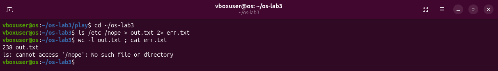

`ls /etc /nope` produces both kinds of output: a listing of `/etc` (normal output) and an error, because `/nope` does not exist.

- `> out.txt` sends channel 1 to `out.txt`.
- `2> err.txt` sends channel 2 to `err.txt`.

Result: `out.txt` has the listing, 238 lines, and `err.txt` has the one error line. Nothing appeared on the screen.

### The order of redirections matters

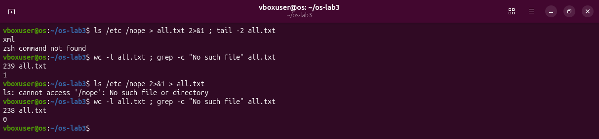

`2>&1` means "send channel 2 to the place where channel 1 is pointing **right now**". Bash reads redirections from left to right.

`ls /etc /nope > all.txt 2>&1`

1. `> all.txt`: channel 1 now points to the file.
2. `2>&1`: channel 2 is sent where channel 1 points, which is the file.

Both go into the file: 239 lines, and `grep -c "No such file"` finds the error line in it (1).

`ls /etc /nope 2>&1 > all.txt`

1. `2>&1`: channel 2 is sent where channel 1 points, which is still the screen.
2. `> all.txt`: channel 1 now points to the file. Channel 2 is not moved again.

The error stays on the screen and the file has only the listing: 238 lines, 0 error lines.

### Appending, and reading from a file

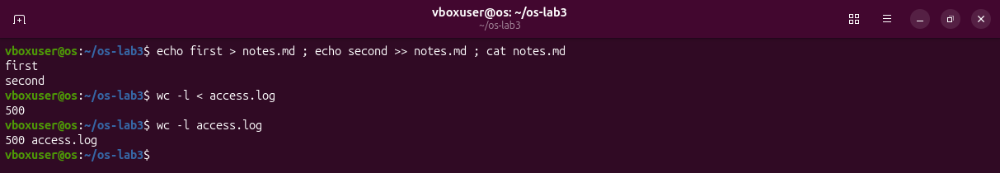

- `>` creates the file or empties it. `>>` adds to the end. So after `echo first > notes.md ; echo second >> notes.md` the file has two lines.
- `<` connects a file to channel 0, the input.
- `wc -l < access.log` prints `500`. `wc -l access.log` prints `500 access.log`. In the first case the shell opened the file and `wc` only received its content, so `wc` does not know any name. In the second case the name is an argument of `wc`, and `wc` prints it.

### Chaining: `;`, `&&`, `||`

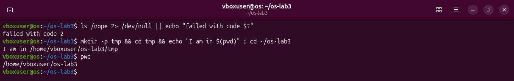

- `a ; b` runs `b` after `a`, whatever happened.
- `a && b` runs `b` only if `a` succeeded (exit code 0).
- `a || b` runs `b` only if `a` failed.

In the picture:

- `ls /nope 2> /dev/null || echo "failed with code $?"`: `ls` fails, its error message is thrown away (`/dev/null` is a file that swallows everything), and because it failed, `echo` runs and shows the exit code, 2.
- `mkdir -p tmp && cd tmp && echo "I am in $(pwd)" ; cd ~/os-lab3`: each step runs only if the one before worked. The last `cd` is after a `;`, so it runs in any case.

### Background jobs

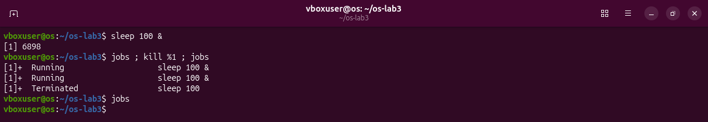

- `sleep 100 &`: the `&` at the end starts the command in the background. Bash answers `[1] 6898`: job number 1, process number 6898, and gives the prompt back at once.
- `jobs` lists the background jobs of this terminal.
- `kill %1` stops job number 1. `%1` is the job number, so I did not need the process number.
- The next `jobs` reports `Terminated`, and after that the list is empty.

### Answers

1. **Which file got the error, which the listing?** `err.txt` got the error, `out.txt` got the listing.
2. **`> all.txt 2>&1` or `2>&1 > all.txt`?** Explained above: redirections are applied left to right, and `2>&1` copies the place where channel 1 points at that moment.
3. **Why does `wc -l < access.log` print only a number?** With `<`, `wc` reads its standard input and never learns the file name.
4. **`;` `&&` `||`:** always; only on success; only on failure.

## Part 4 – Answer questions with one-liners

### The tools

Each of these does one small job on lines of text. Joined with pipes they answer real questions.

| Tool | What it does |
|---|---|
| `grep WORD file` | keeps only the lines that contain WORD. `-c` counts them instead of printing them. `-E` allows extended patterns |
| `cut -d' ' -f3` | keeps only field 3 of each line, where fields are separated by the character after `-d` |
| `sort` | sorts lines. `-u` removes duplicates, `-n` sorts as numbers, `-r` reverses |
| `uniq -c` | merges equal lines that are next to each other and writes how many there were. This is why `sort` always comes before it |
| `wc -l` | counts lines |
| `head -3`, `tail -3` | the first or the last 3 lines |
| `nl` | numbers the lines |

The pattern given in the sheet shows the typical shape, filter, cut, sort, count, sort again:

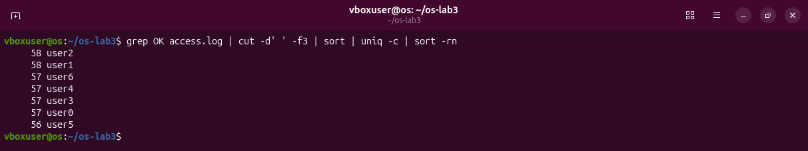

`grep OK access.log | cut -d' ' -f3 | sort | uniq -c | sort -rn` reads: take the successful lines, keep only the user, sort so equal users are together, count each, and put the biggest count first.

### Q1. How many requests failed?

```bash
grep -c FAIL access.log
```

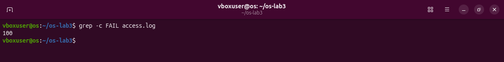

`-c` makes `grep` print the number of matching lines. **100 requests failed.**

### Q2. How many different pages were requested, and which?

```bash
cut -d' ' -f5 access.log | sort -u | nl
```

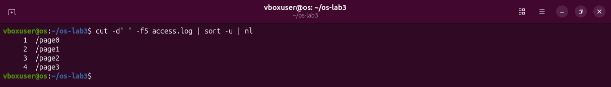

Field 5 is the page. `sort -u` leaves one line for each different page, and `nl` numbers them, so the last number is the count. **4 pages: `/page0`, `/page1`, `/page2`, `/page3`.**

### Q3. How many requests did each page get?

```bash
cut -d' ' -f5 access.log | sort | uniq -c
```


**125 each.** Check: 4 x 125 = 500, the number of lines in the log.

### Q4. Which user or users have the most failed requests, and how many?

```bash
grep FAIL access.log | cut -d' ' -f3 | sort | uniq -c | sort -rn | head -3
```

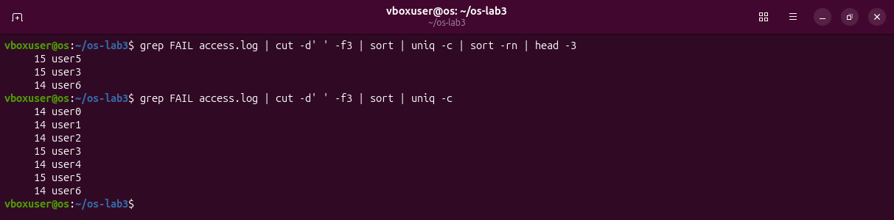

Only failed lines, only the user, count per user, biggest first. I print three lines and not one, because the first two are equal. **`user3` and `user5`, with 15 failed requests each.** The second command in the picture is the full list: the seven counts add up to 100, the answer of Q1, so the pipeline counts the right thing.

### Q5. How many requests did user3 make, and how many of them failed?

```bash
echo "$(grep -c ' user3 ' access.log) requests, $(grep ' user3 ' access.log | grep -c FAIL) failed"
```

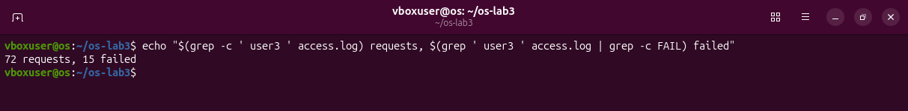

Two counts are needed, so each is computed inside `$( )` and `echo` puts them in one sentence. The spaces around ` user3 ` make sure a whole field is matched. **72 requests, 15 failed.**

### Q6. Print the last 3 failed requests, showing only time and user

```bash
grep FAIL access.log | tail -3 | cut -d' ' -f2,3
```

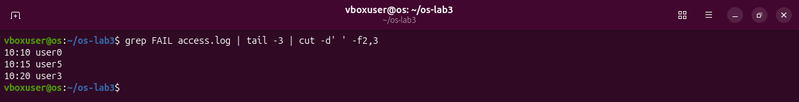

`tail -3` keeps the last three failed lines, and `-f2,3` keeps fields 2 and 3. **`10:10 user0`, `10:15 user5`, `10:20 user3`.**

### Q7. Which login shells appear in /etc/passwd, and how many accounts use each?

```bash
cut -d: -f7 /etc/passwd | sort | uniq -c | sort -rn
```

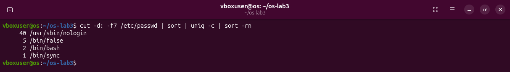

`/etc/passwd` has one line per account, with fields separated by `:`. Field 7 is the program started when that account logs in. **`/usr/sbin/nologin` 40, `/bin/false` 5, `/bin/bash` 2, `/bin/sync` 1.** Most accounts belong to system services and are not meant for a person, so their "shell" is a program that refuses the login. The two `bash` accounts are `root` and `vboxuser`.

### Q8. Why do `ls /etc | wc -l` and `ls -l /etc | wc -l` differ by exactly one?

```bash
ls /etc | wc -l ; ls -l /etc | wc -l ; ls -l /etc | head -1
```

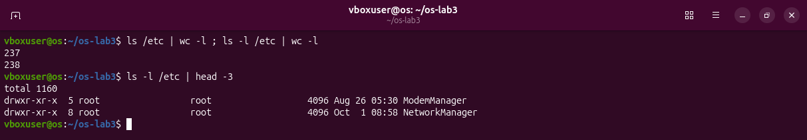

My prediction was that both print the same number. They print **237 and 238**. The long format starts with one extra line, `total 1160` (the disk space used by the entries), before the first entry. `head` makes that line visible.

### The whole file

`oneliners.sh` holds the eight commands, each under a comment with its question. It was written in the `nano` editor:

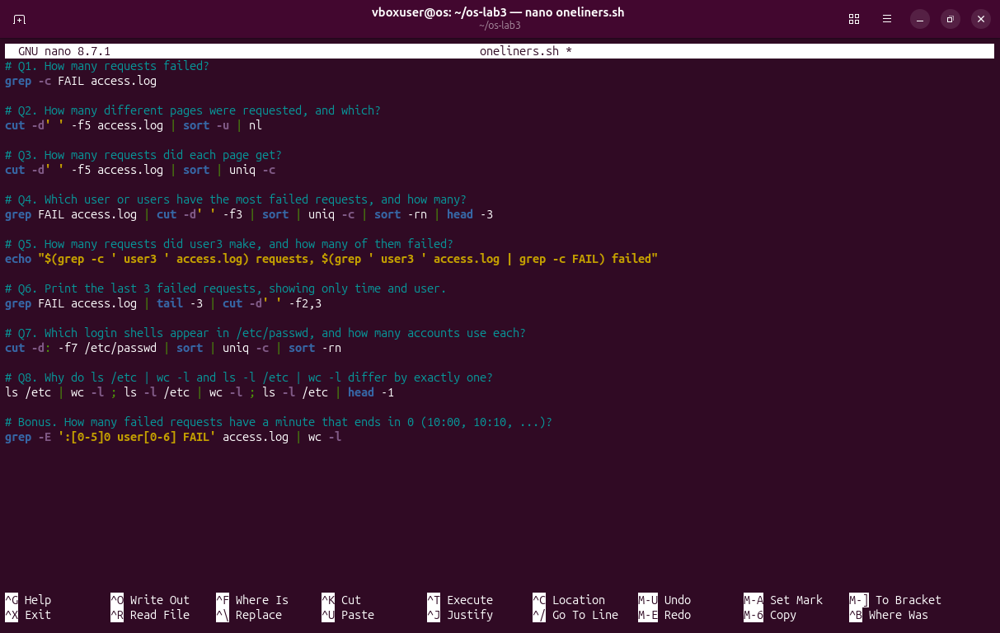

and it runs with `bash oneliners.sh` inside `~/os-lab3`:

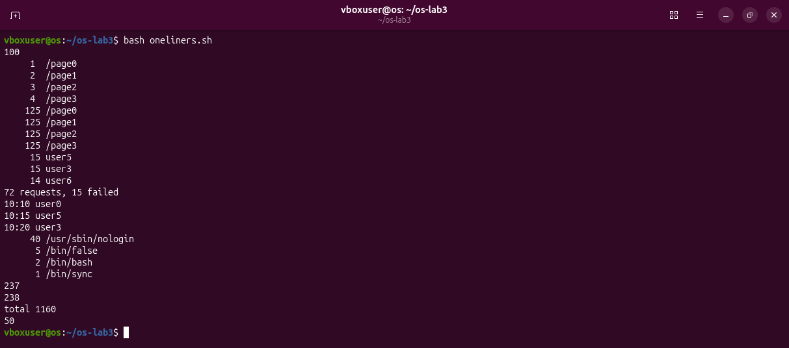

Lines that start with `#` are comments; bash skips them.

### Bonus: failed requests in a minute that ends in 0

```bash
grep -E ':[0-5]0 user[0-6] FAIL' access.log | wc -l
```

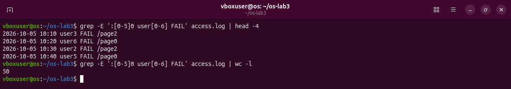

`[0-5]` is one character from 0 to 5, so `:[0-5]0 ` matches the minutes 00, 10, 20, 30, 40, 50. Then comes the user and the word `FAIL`. **50 lines.**

## Part 5 – Your first script

A script is a text file with commands. `report.sh` turns the one-liners into a small program that takes the log file as an argument.

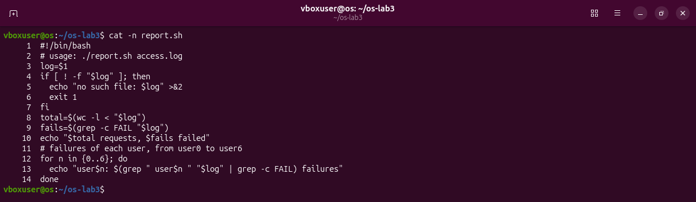

Line by line:

| Line | Meaning |
|---|---|
| 1 `#!/bin/bash` | Tells the system which program must read this file. It has to be the very first line |
| 3 `log=$1` | `$1` is the first argument given to the script. It is saved under the name `log` |
| 4 `if [ ! -f "$log" ]; then` | `-f` asks "is this an existing file?" and `!` turns it around: if it is **not** a file |
| 5 `echo "no such file: $log" >&2` | Print the message on channel 2, the error channel |
| 6 `exit 1` | Stop the script with exit code 1, which means failure |
| 8 `total=$(wc -l < "$log")` | Number of lines. The `<` is why only the number is stored, without the file name (Part 3) |
| 9 `fails=$(grep -c FAIL "$log")` | Number of lines that contain FAIL |
| 10 | Prints the summary |
| 12 `for n in {0..6}; do` | The part I wrote: repeat for `n` = 0, 1, ... 6 (brace expansion from Part 2) |
| 13 | For each user: take that user's lines, count the ones with FAIL, print `userN: X failures` |

### Running it

A new file is not allowed to run as a program:

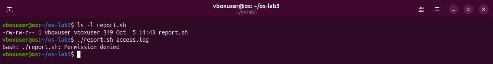

The permissions are `-rw-rw-r--`: read and write, but no `x` (execute). Bash answers `Permission denied`. `chmod +x report.sh` adds the execute permission:

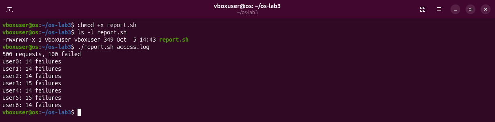

The output agrees with Part 4: 500 requests, 100 failed, and 15 failures for `user3` and `user5`.

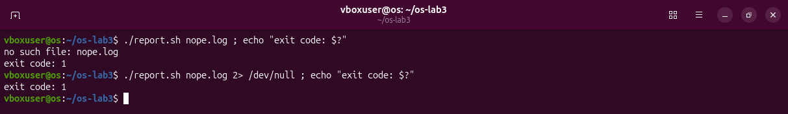

With a file that does not exist, the script prints its message and ends with exit code 1. In the second command `2> /dev/null` throws away channel 2, and the message disappears. That proves it was written to stderr, while the exit code is still 1.

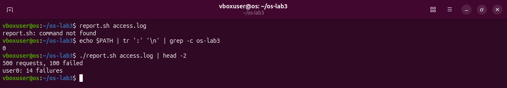

`report.sh access.log` gives `command not found`. Bash looks for commands only in the folders of `PATH`, and `~/os-lab3` is not one of them (the `grep -c` prints 0). `./report.sh` gives the path directly: `.` is the current folder.

### Answers

1. **What does `#!/bin/bash` do, and what happens before `chmod +x`?** It names the interpreter of the file. Without the execute permission the answer is `Permission denied`.
2. **Why `./report.sh` and not `report.sh`?** The current folder is not in `PATH`, so the path has to be given.
3. **Why `>&2` and `exit 1`?** Errors go to their own channel so they do not mix with the real output, and the exit code lets other commands (`&&`, `||`, another script) know that it failed.

### Bonus: running it with cron

`cron` is a service that runs commands at given times. Each user has a table of jobs, edited with `crontab -e`. I added one line:

```
* * * * * /home/vboxuser/os-lab3/report.sh /home/vboxuser/os-lab3/access.log >> /home/vboxuser/os-lab3/report.log 2>&1
```

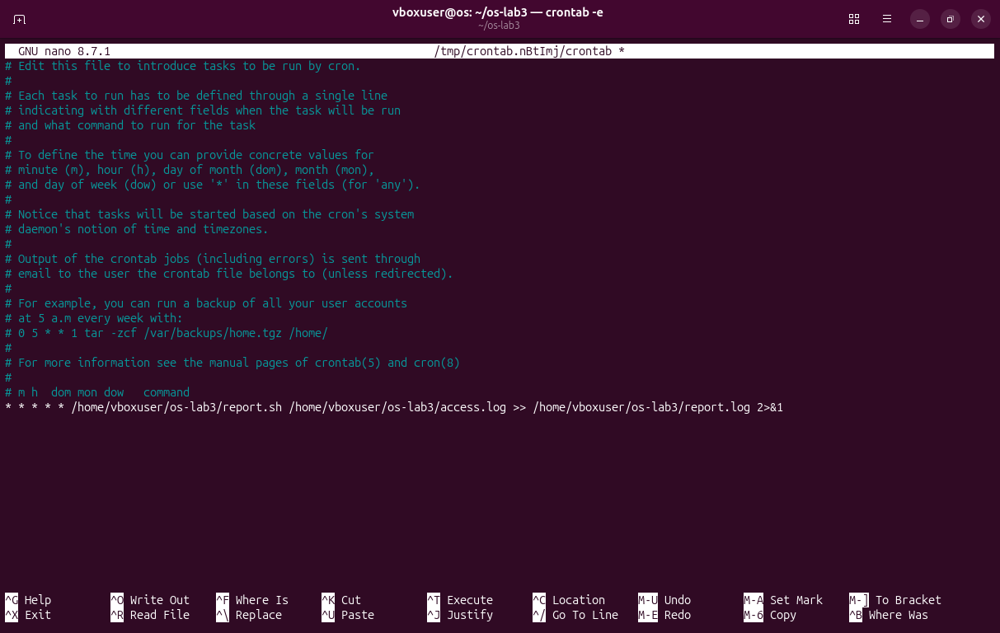

- The five fields at the start are minute, hour, day of month, month, day of week. A `*` means "every", so five stars mean every minute.
- Full paths are needed, because cron does not start in my folder.
- `>> ... 2>&1` adds both the output and the errors to `report.log`.

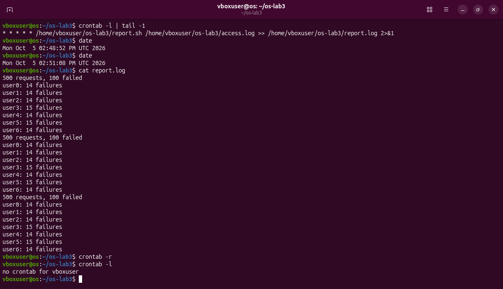

Between 14:48:52 and 14:51:08 cron ran the script three times, and the log holds three copies of the output. Then `crontab -r` deleted my crontab, and `crontab -l` confirms there is none left.

## What I learned

- The shell rewrites the line before any program starts. Patterns, variables, quotes and redirections are all handled by bash, not by the programs.
- Programs have three channels. Sending them to files, and the order in which that is done, decides what ends up where.
- Exit codes are how commands tell each other whether they worked. `&&` and `||` are built on them.
- Small filters joined by pipes answer questions about data in one line, and the same lines saved in a file become a program.
