# Lab 4 – The xv6 Shell from the Outside

Course: Operating Systems, FCIM / FAF, UTM, 2026-2027. Track B: build your own small OS (xv6).

This page explains everything that was done in the lab, step by step: every command, what it printed, and why. The figure numbers are the same as in the Word report, so the two can be read side by side.

## What is in this folder

| File | What it is |
|---|---|
| `Lab4_EftodeAndrei_FAF-242.docx` | The report: title page, 21 screenshots, the comparison table, the answers to every Observe box |
| `sleep.c` | The `sleep` program from Lab 2, changed to build on the current xv6 (it calls `pause()`). In xv6 it lives in `user/sleep.c` |
| `args.c` | A program for xv6 that prints the arguments it receives. In xv6 it lives in `user/args.c` |
| `args_linux.c` | The same program for Linux |
| `Makefile` | The xv6 Makefile with my two lines in `UPROGS`: `$U/_sleep\` and `$U/_args\` |
| `screenshots/` | The terminal screenshots shown on this page (`fig-1-1.png` is Figure 1.1, and so on) |

## How to run it

```bash
# xv6 side: put the files into an xv6 tree at revision 06aad25
cp sleep.c args.c ~/xv6-riscv/user/
cp Makefile ~/xv6-riscv/
cd ~/xv6-riscv && make qemu
# at the xv6 prompt:  sleep 20      args one two three
# leave xv6: press Ctrl-A, release, then press X

# Linux side
gcc -o args args_linux.c
./args *.c "x y"
```

## Words used on this page

- **xv6**: a very small teaching operating system from MIT. Its whole source is about 11,000 lines of C.
- **QEMU**: a program that pretends to be a RISC-V computer, so xv6 has something to run on. `make qemu` builds xv6 and starts it.
- **Two prompts.** `vboxuser@os:~/xv6-riscv$` is bash on Linux. A lonely `$` is the xv6 shell, running inside QEMU.
- **`user/sh.c`**: the xv6 shell. It is one ordinary user program, 499 lines long.
- **`UPROGS`**: a list in the xv6 Makefile. Only the programs named there are built and copied onto the xv6 disk.
- **`fork` and `exec`**: the two system calls every shell is built on. `fork` makes a copy of the running process; `exec` replaces the program in a process with another one.

## Before the lab

The lab sheet asks to check that xv6 builds and boots:

```bash
bash os2026-setup.sh --check
```

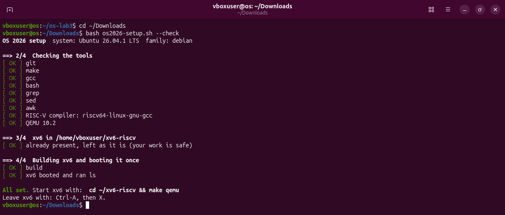

With `--check` the script installs nothing. It checks the tools, builds xv6 and boots it once. The last line is **All set.**

## Part 1 – Fix sleep for the current xv6

### The problem

In Lab 2 I wrote `user/sleep.c`, a program that calls the system call `sleep()`. In August 2025 the authors of xv6 renamed that system call to `pause()`. A program that still calls `sleep()` does not build on the current xv6.

In Lab 2 I had avoided the problem by working on an older version of xv6, the last one before the rename, on a branch I called `lab2`. The course now works on a newer revision, `06aad25` (it is written inside `os2026-setup.sh`), so for this lab I moved to it.

### Checking which name the tree uses

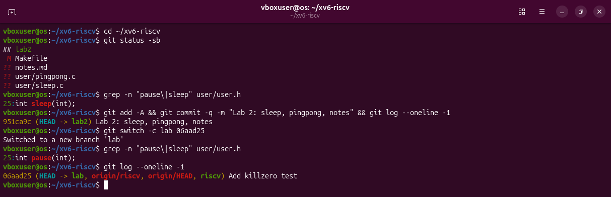

Reading the picture from the top:

1. `git status -sb` shows where I am: branch `lab2`, with the Makefile modified (`M`) and three new files that git does not know yet (`??`). This is my Lab 2 work.
2. `grep -n "pause\|sleep" user/user.h` searches the file `user/user.h` for the word `pause` or `sleep`. `user.h` is the list of everything a user program may call. The answer is line 25: `int sleep(int);`. This old tree still has `sleep`.
3. `git add -A && git commit ...` saves the Lab 2 work as a commit on branch `lab2`, so nothing is lost when I move away.
4. `git switch -c lab 06aad25` creates a new branch named `lab` at revision `06aad25` and moves to it. The files on disk now are the current xv6.
5. The same `grep` now answers `int pause(int);`. The system call has its new name here.

### What happens with the old sleep.c

To see the problem with my own eyes, I brought the Lab 2 file into the new tree and tried to build it.

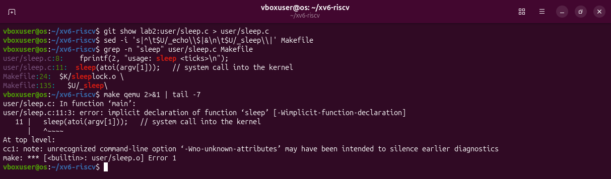

- `git show lab2:user/sleep.c > user/sleep.c` takes the file as it is saved on branch `lab2` and writes it here.
- The `sed` line adds `$U/_sleep\` to `UPROGS` in the Makefile, right after the line for `_echo`. `sed -i 's|A|B|' file` replaces A with B inside the file. Here A is the `_echo` line and B is that same line (`&`) followed by a new line for `_sleep`.
- `make qemu 2>&1 | tail -7` builds and shows only the last 7 lines.

The compiler stops with:

```
user/sleep.c:11:3: error: implicit declaration of function 'sleep'
```

"Implicit declaration" means: the program calls a function that no header has announced. `user.h` no longer has `sleep`, so the compiler does not know what it is. The build fails and xv6 does not start.

### The fix

One line changes: the call on line 11.

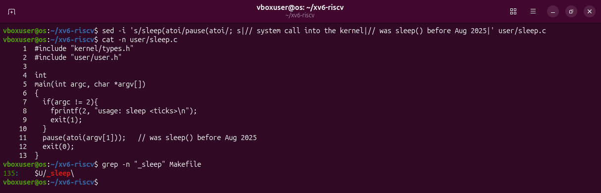

```c
#include "kernel/types.h"
#include "user/user.h"

int
main(int argc, char *argv[])
{
  if(argc != 2){
    fprintf(2, "usage: sleep <ticks>\n");
    exit(1);
  }
  pause(atoi(argv[1]));   // was sleep() before Aug 2025
  exit(0);
}
```

- `argc` is the number of words on the command line and `argv` holds them. For `sleep 20`, `argc` is 2, `argv[0]` is `sleep` and `argv[1]` is `20`.
- If the number is missing, the program prints how it should be used on channel 2 (the error channel) and ends with status 1.
- `atoi` turns the text `20` into the number 20.
- `pause(20)` asks the kernel not to run this process for 20 ticks. A tick is about a tenth of a second.

The last line of the picture confirms that `$U/_sleep\` is at line 135 of the Makefile.

### Build, boot, test

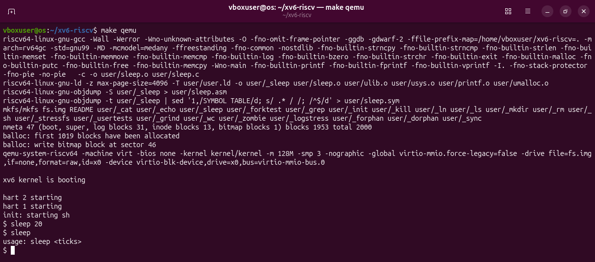

`make qemu` compiled `sleep.c`, built a new disk image with `_sleep` on it and started xv6. Then, at the xv6 prompt:

- `sleep 20` waited about two seconds and returned without printing anything.
- `sleep` with no number printed `usage: sleep <ticks>`.

## Part 2 – bash versus the xv6 shell

The same ten command lines were typed twice: in bash, inside an empty folder `~/shtest` that holds one file named `README`, and at the xv6 prompt.

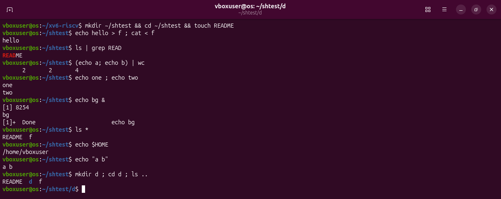

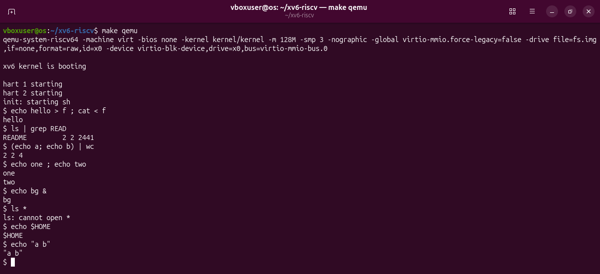

### The comparison table

| Command | Tests | bash | xv6 |
|---|---|---|---|
| `echo hello > f ; cat < f` | redirection | `hello`. Both `>` and `<` work. | `hello`. Both work. |
| `ls \| grep READ` | pipe | `README` | `README 2 2 2441`. The pipe works; the xv6 `ls` also prints type, inode and size. |
| `(echo a; echo b) \| wc` | grouping, list | `2 2 4` | `2 2 4`. Parentheses and `;` work. |
| `echo one ; echo two` | sequence | `one` then `two` | `one` then `two` |
| `echo bg &` | background | `[1] 8254`, `bg`, then `[1]+ Done`. Bash numbers the job and reports its end. | `bg`. It runs in the background, but there are no job numbers. |
| `ls *` | globbing | `README f`. Bash replaced `*` with the file names. | `ls: cannot open *`. The star reached `ls` unchanged. |
| `echo $HOME` | variables | `/home/vboxuser` | `$HOME`. There are no variables. |
| `echo "a b"` | quotes | `a b`. Bash removed the quotes. | `"a b"`. The quotes are ordinary characters. |
| `mkdir d ; cd d ; ls ..` | PATH | `README d f`. `cd` is a built-in and `ls` is found through `PATH`. | `exec cd failed`, then the listing of `/`. Inside a list `cd` is run as a program, and there is none. |
| arrow up, Tab, Ctrl+R | history, completion | The last command returns, `cat RE` becomes `cat README`, Ctrl+R searches. | Nothing useful: the keys become characters of the command, which then fails. |

### Row by row

1. **Redirection.** `echo hello > f` writes into the file `f`, and `cat < f` reads it back. Both shells can connect a program to a file.
2. **Pipe.** The output of `ls` becomes the input of `grep`. In xv6 the line is longer because the xv6 `ls` always prints three numbers after the name: the type (2 = file), the inode number and the size in bytes.
3. **Grouping.** The parentheses run two commands as one unit, so the output of both goes into the pipe. `wc` counts 2 lines, 2 words, 4 characters.
4. **Sequence.** `;` runs one command after the other, in both shells.
5. **Background.** In bash, `&` gives the job a number (`[1]`), prints its process number, and later reports `Done`. The xv6 shell just starts the command and does not wait for it. It keeps no list of jobs.
6. **Globbing.** Bash replaces `*` with the names in the folder before it starts `ls`. The xv6 shell does not know that `*` is special, so `ls` receives the one-character name `*`, and no file has that name.
7. **Variables.** The xv6 shell has none. `$HOME` is passed to `echo` as five ordinary characters.
8. **Quotes.** Bash removes the quotes and keeps `a b` together as one argument. The xv6 shell does not know quotes: it cuts at the space and passes `"a` and `b"`. `echo` prints them with a space between, so the screen shows `"a b"` with the quotes still there.
9. **PATH and `cd`.** See the next section.
10. **History and completion.** See below.

### `ls` stops working after `cd d`

In xv6 the ninth line prints `exec cd failed` and then a long listing:

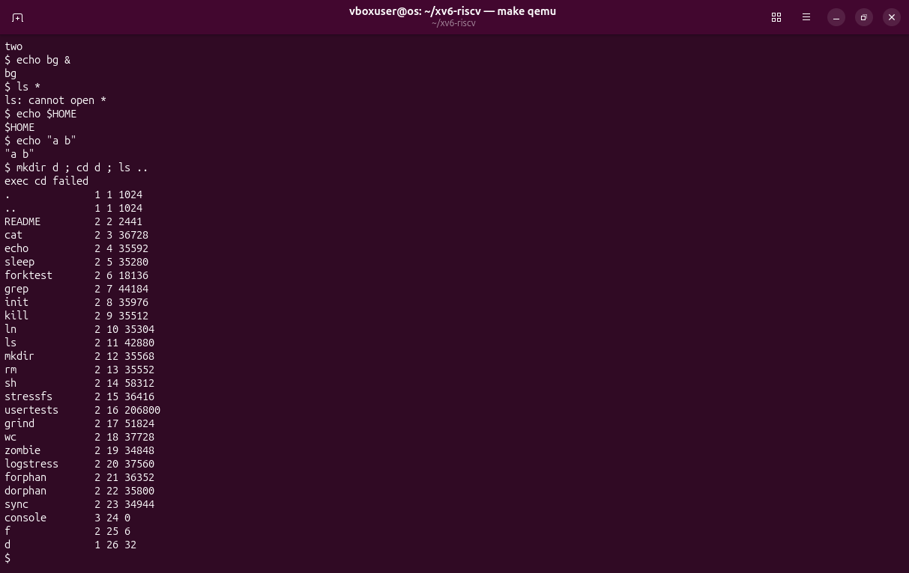

The xv6 shell treats `cd` specially only when the whole line starts with `cd `. Here `cd d` is in the middle of a list, so the shell tries to run a program called `cd`. There is no such program, and `exec` fails. The shell never moved, so `ls ..` lists the parent of the root folder, which is the root folder itself. The new entries `f` and `d` are at the bottom.

Typed alone on a line, `cd d` works. Then comes the real surprise:

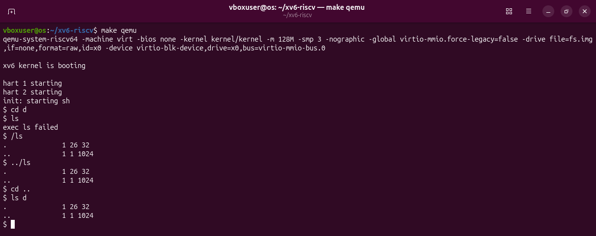

- `cd d` moves the shell into the folder `d`.
- `ls` answers `exec ls failed`. The xv6 shell has no `PATH`. It gives the name `ls` to `exec` exactly as typed, and `exec` looks for a file `ls` in the current folder, which is now `d`. All the xv6 programs are files in the root folder `/`, so from inside `d` they are not found.
- `/ls` works: the name now says where the file is, in the root folder.
- `../ls` works too: "the file `ls` one folder up".

In bash this never happens, because bash searches the folders of `PATH` wherever I am.

### History and completion

In bash:

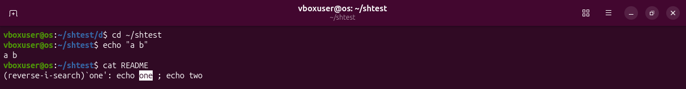

- The up arrow, pressed four times, brought back `echo "a b"` from the history, and Enter ran it again.
- I typed `cat RE` and pressed Tab: it became `cat README`.
- Ctrl+R followed by `one` found the earlier line `echo one ; echo two`.

In xv6 the same keys do nothing useful:

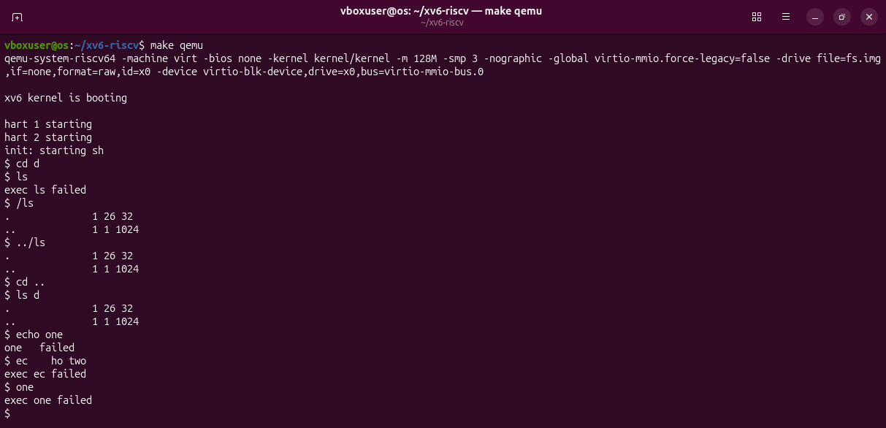

The bottom lines of the picture, after `ls d`:

- After `echo one` I pressed the up arrow and Enter. The arrow key sends three invisible characters to the computer. bash understands them; the xv6 shell takes them as the name of a command and answers `exec ... failed`. The same invisible characters also move the cursor on my screen, which is why `failed` landed on the line above, next to `one`.
- I typed `ec`, Tab, `ho two`. Tab did not complete anything: it was taken as white space, so the command became `ec` with two arguments. `exec ec failed`.
- Ctrl+R followed by `one` did not search. Ctrl+R was taken as one more invisible character at the start of the command, and the shell answered `exec one failed`.

### Answers

1. **Features both shells have, and features only bash has.** Both: running programs with arguments, redirection (`<`, `>`), pipes, lists with `;`, grouping with parentheses, background with `&`, and a built-in `cd`. Only bash: globbing, variables, quotes, a search `PATH`, job control, history, Tab completion and Ctrl+R.
2. **Why does `ls` stop working after `cd d`, and how to run it anyway?** The xv6 shell has no `PATH`: `exec` looks for `ls` only in the current folder, and the programs are in `/`. Give the path: `/ls` or `../ls`.
3. **Which missing feature would I miss most, and which is easiest to add?** History and Tab completion, because I use them in almost every command. The easiest to add would be a one-folder `PATH`: when `exec` fails for a name without `/`, try again with `/` in front of the name.

## Part 3 – Who expands `*`? A program that prints its argv

### The program

`args` prints how many arguments it received and shows each one between square brackets. The brackets make spaces and quotes visible.

```c
#include "kernel/types.h"
#include "user/user.h"

int
main(int argc, char *argv[])
{
  printf("argc = %d\n", argc);
  for(int i = 0; i < argc; i++)
    printf("argv[%d] = [%s]\n", i, argv[i]);
  exit(0);
}
```

It was written in the `nano` editor as `user/args.c`:

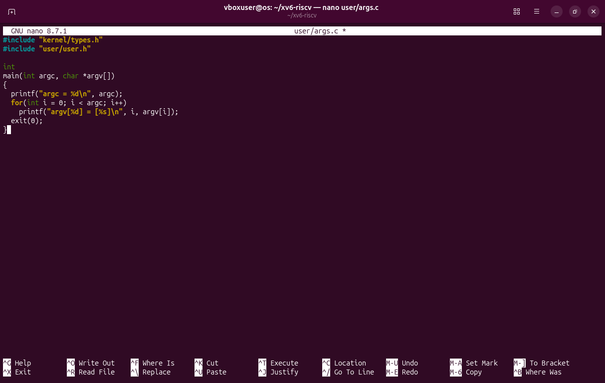

and added to `UPROGS` with the same kind of `sed` line as `sleep`:

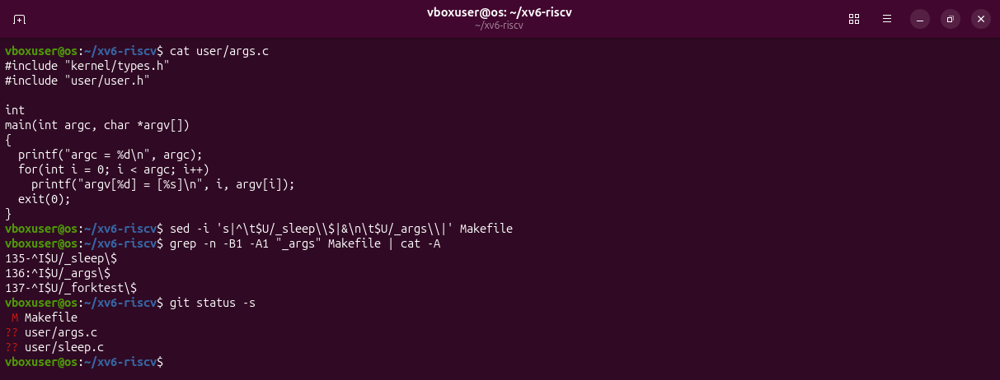

`grep ... | cat -A` shows the three Makefile lines with their invisible characters: `^I` is a Tab and `$` marks the end of each line. Every `UPROGS` line must start with a Tab and end with a backslash, with nothing after it. `git status -s` then lists what changed in the tree: the Makefile, and two new files.

The Linux version, `args_linux.c`, is the same program with two differences: it includes `<stdio.h>` instead of the two xv6 headers, and it ends with `return 0` instead of `exit(0)`.

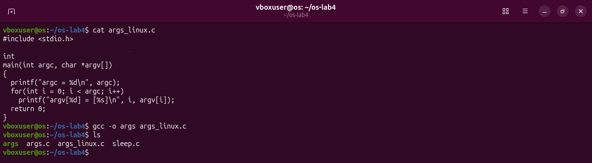

`gcc -o args args_linux.c` compiles it into a program named `args`. The folder `~/os-lab4` also holds copies of `args.c` and `sleep.c`, so that `*.c` has something to match.

### The same four lines in both shells

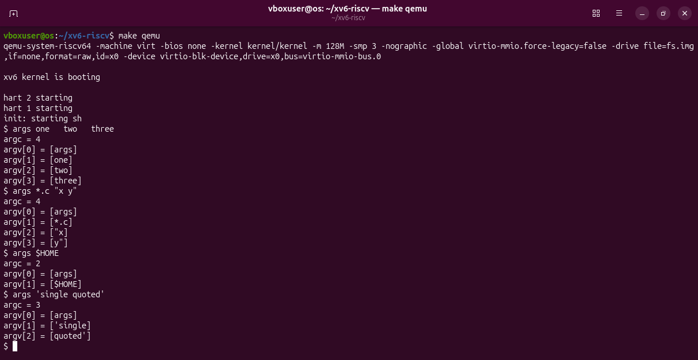

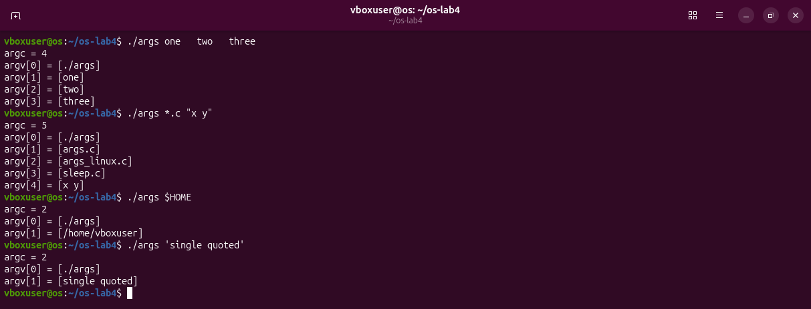

| Line | bash | xv6 |
|---|---|---|
| `args one   two   three` | `argc = 4`: `[./args] [one] [two] [three]` | `argc = 4`: `[args] [one] [two] [three]` |
| `args *.c "x y"` | `argc = 5`: `[./args] [args.c] [args_linux.c] [sleep.c] [x y]` | `argc = 4`: `[args] [*.c] ["x] [y"]` |
| `args $HOME` | `argc = 2`: `[./args] [/home/vboxuser]` | `argc = 2`: `[args] [$HOME]` |
| `args 'single quoted'` | `argc = 2`: `[./args] [single quoted]` | `argc = 3`: `[args] ['single] [quoted']` |

The program is the same on both sides. It prints exactly what it was given. So every difference in this table was made **before** the program started, by the shell.

### Answers

1. **Both outputs for `args *.c "x y"`, and how many arguments each program received.** In bash, `argc = 5`: after its own name the program received four arguments, three file names and `x y` as a single argument. In xv6, `argc = 4`: it received three arguments, the star unchanged and the quoted text cut in two, with the quote characters still on the pieces.
2. **Who turns `*.c` into file names and removes the quotes?** The shell. Not the program (it is identical in both systems) and not the kernel (it passes `argv` on exactly as it receives it). Bash did the work before calling `exec`; the xv6 shell did not.
3. **What happened to the extra spaces in `one   two   three`?** They disappeared in both shells. A shell cuts the line into words at any amount of white space, and the program gets only the words. `argc = 4` on both sides.

## Part 4 – Read the shell

The last part looks inside `user/sh.c` to find the reason for everything seen above.

### How the xv6 shell works, in short

1. `main` reads one line (`getcmd`, which also prints the `$ ` prompt).
2. If the line starts with `cd `, the shell changes folder itself.
3. Otherwise it calls `fork`. The child turns the line into a small tree of commands (`parsecmd`) and runs it (`runcmd`). The parent waits for the child to finish.

### The kinds of command

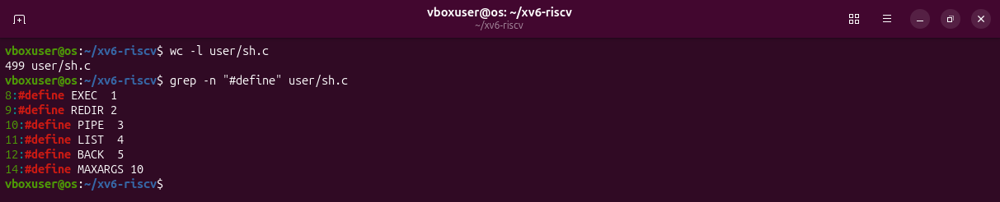

`wc -l` counts the lines of the file: 499. `grep -n "#define"` shows the constants at the top. Five of them are the kinds of command the shell knows:

| Kind | Produced by | Example |
|---|---|---|
| `EXEC` | no special character: a plain command | `ls` |
| `REDIR` | `<`, `>`, `>>` | `echo hello > f` |
| `PIPE` | `\|` | `ls \| grep READ` |
| `LIST` | `;` | `echo one ; echo two` |
| `BACK` | `&` | `echo bg &` |

`MAXARGS 10` is not a kind: it is the largest number of arguments one command may have.

### Where each kind is run

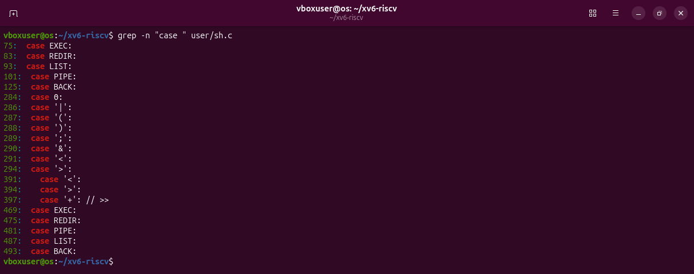

`grep -n "case "` finds every `case` of the `switch` statements. They fall into four groups:

- **Lines 75 to 125**, in the function `runcmd`: one `case` for each kind. This is where commands are really executed. `EXEC` calls `exec`; `REDIR` opens the file and then runs the command; `LIST` runs the left side, waits, then runs the right side; `PIPE` creates a pipe and forks twice; `BACK` forks and does not wait.
- **Lines 284 to 294**, in `gettoken`: the characters the shell recognises while cutting the line into pieces: `|`, `(`, `)`, `;`, `&`, `<`, `>`.
- **Lines 391 to 397**, in `parseredirs`: the three redirections. `+` is how the code names `>>` internally.
- **Lines 469 to 493**, in `nulterminate`: housekeeping that ends each word with a zero byte.

### Where `cd` is handled

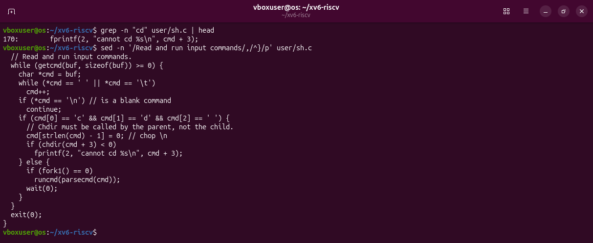

`grep -n "cd"` finds only the error message at line 170, so the picture also prints the loop around it. The important lines are in `main`, starting at line 166:

```c
if (cmd[0] == 'c' && cmd[1] == 'd' && cmd[2] == ' ') {
  // Chdir must be called by the parent, not the child.
  cmd[strlen(cmd) - 1] = 0; // chop \n
  if (chdir(cmd + 3) < 0)
    fprintf(2, "cannot cd %s\n", cmd + 3);
} else {
  if (fork1() == 0)
    runcmd(parsecmd(cmd));
  wait(0);
}
```

- The test looks at the first three characters of the line: `c`, `d`, space. This explains Part 2: `cd d` at the start of a line is recognised, but inside `mkdir d ; cd d ; ls ..` it is not, because that line starts with `m`.
- When it matches, the shell itself calls `chdir`. There is no `fork`.
- Every other line goes to the `else`: `fork`, and the child runs the command.

`cd` cannot be a separate program. Each process has its own current folder. A child that changes folder changes only its own, then exits, and the shell is still where it was. The comment in the code says exactly this.

### Is there any code for `*` or `$`?

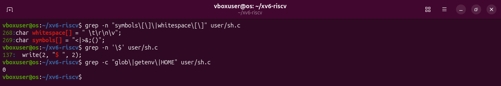

- Line 269, `char symbols[] = "<|>&;()";`, is the complete list of special characters. There is no `*`, no `$`, no quote character in it.
- `grep -n '\$'` finds a dollar sign in only one place, line 137: `write(2, "$ ", 2);`. That is the prompt.
- `grep -c "glob\|getenv\|HOME"` counts 0 lines.

So the xv6 shell has no globbing and no variables at all. That is why, in Part 2, `ls *`, `echo $HOME` and `echo "a b"` reached the programs exactly as they were typed.

### Answers

1. **The five kinds of command and the character that produces each.** `EXEC` (none, a plain command), `REDIR` (`<`, `>`, `>>`), `PIPE` (`|`), `LIST` (`;`), `BACK` (`&`).
2. **Where is `cd` handled, and why is it not a separate program?** In `main`, at line 166, before any `fork`. A separate process would change only its own current folder.
3. **Is there code that handles `*` or `$`, and what does that explain?** No. It explains why those characters were passed through unchanged in Part 2.

## The xv6 tree at the end

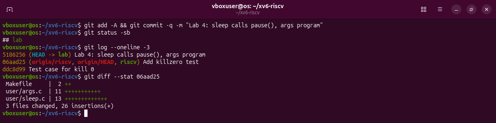

The work is saved as one commit on branch `lab`, on top of revision `06aad25`. `git diff --stat 06aad25` lists everything that differs from the original xv6: two lines in the Makefile and the two new programs.

## What I learned

- A shell needs very little: read a line, cut it into words, `fork`, connect the redirections and pipes, `exec`. xv6 does all of it in 499 lines.
- Globbing, variables, quotes, `PATH`, history, completion and job control are not part of the operating system. They are features of bash.
- A program only ever sees its `argv`. The `args` program made that visible: the same program received different arguments from the two shells.
- `cd` has to be a built-in in every shell, for the same reason in bash (Lab 3) and in xv6.
